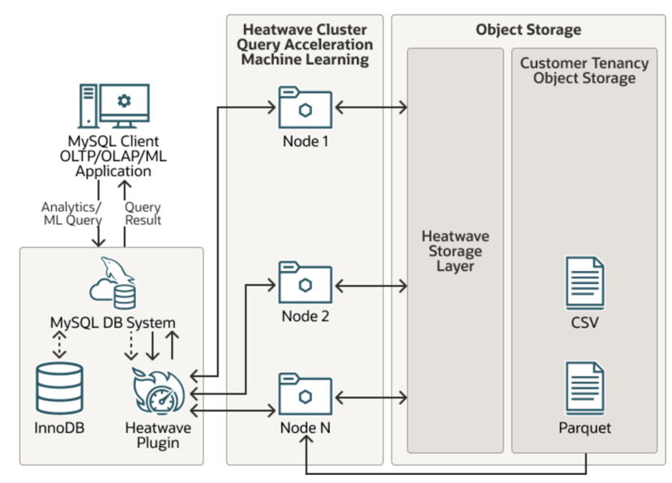
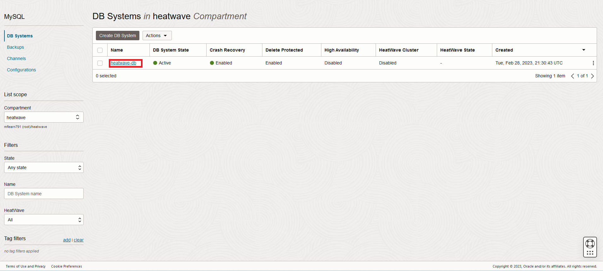
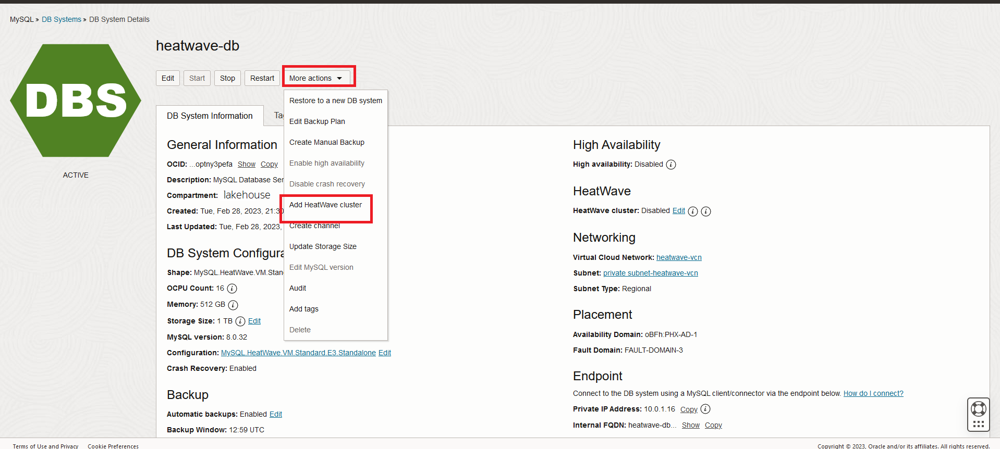
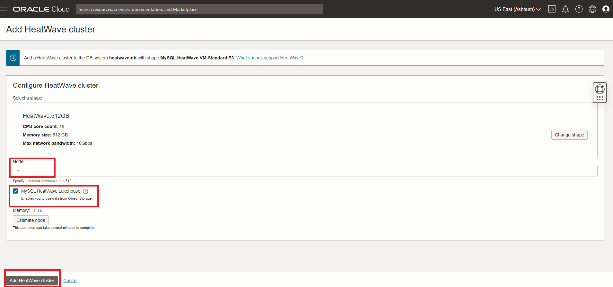
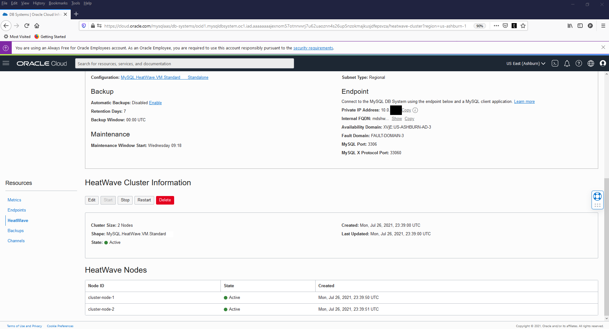

# Create Mysql HeatWave Cluster and test MySQl Shell

## Introduction

A HeatWave cluster comprise of a MySQL DB System and one or more HeatWave nodes. The MySQL DB System includes a plugin that is responsible for cluster management, loading data into the HeatWave cluster, query scheduling, and returning query result.

_Estimated Time:_ 15 minutes

### Objectives

In this lab, you will be guided through the following task:

- Add a HeatWave Cluster to heatwave-db MySQL Database System
- Connect to database using MySQL Shell

### Prerequisites

- An Oracle Trial or Paid Cloud Account
- Some Experience with MySQL Shell
- Completed Lab 2

## Task 1: Add a HeatWave Cluster to heatwave-db MySQL Database System

1. Go to Navigation Menu
    Databases
        MySQL

2. Click the `heatwave-db` Database System link

    

3. In the list of DB Systems, click the **heatwave-db** system. click **More Action ->  Add HeatWave Cluster**.
    

4. Enable the **MySQL HeatWave LakeHouse** checkbox

5. Set **Node Count to 2** for this Lab Click **Add HeatWave Cluster** to create the HeatWave cluster

    

6. HeatWave creation will take about 10 minutes. From the DB display page scroll down to the Resources section.

7. Click the **HeatWave** link. Your completed HeatWave Cluster Information section will look like this:
    

You may now **proceed to the next lab**

## Acknowledgements

- **Author** - Perside Foster, MySQL Solution Engineering

- **Contributors** - Abhinav Agarwal, Senior Principal Product Manager, Nick Mader, MySQL Global Channel Enablement & Strategy Manager
- **Last Updated By/Date** - Perside Foster, MySQL Solution Engineering, May 2023
