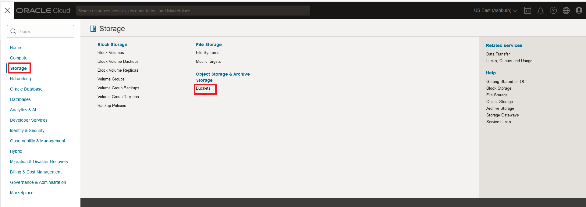
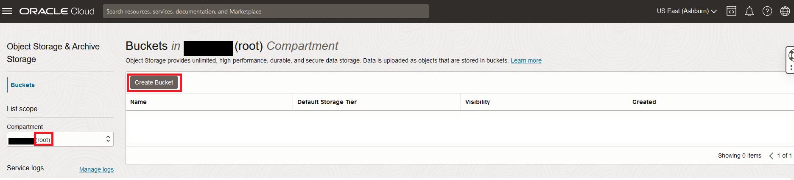

# Create and store data for Lakehouse

## Introduction

Lorem ipsum dolor sit amet, consectetur adipiscing elit, sed do eiusmod tempor incididunt ut labore et dolore magna aliqua.

### Objectives

Lorem ipsum dolor sit amet, consectetur adipiscing elit, sed do eiusmod tempor incididunt ut labore et dolore magna aliqua.

### Prerequisites

Lorem ipsum dolor sit amet, consectetur adipiscing elit, sed do eiusmod tempor incididunt ut labore et dolore magna aliqua.

## Task 1: Download and unzip  Sample files

1. If not already connected with SSH, on Command Line, connect to the Compute instance using SSH ... be sure replace the  "private key file"  and the "new compute instance ip"

     ```bash
    <copy>ssh -i private_key_file opc@new_compute_instance_ip</copy>
     ```

2. Setup folder to house imported sample data

    a. Create folder

    ```bash
    <copy>mkdir lakehouse</copy>
     ```

    b. Go into folder

    ```bash
    <copy>cd lakehouse</copy>
     ```

3. Download sample files

    ```bash
    <copy>wget https://objectstorage.us-ashburn-1.oraclecloud.com/p/TGmbWNTNxauEBSZKxOaKPggbJRz2k_3i6XiDp5Kq5LRJ3c47Z-U8bb_iuSweoi9X/n/mysqlpm/b/plf_mysql_customer_orders/o/lakehouse/lakehouse-order.zip</copy>
     ```

4. Unzip sample files

    ```bash
    <copy>unzip lakehouse-order.zip</copy>
     ```

## Task 2: Create Object Storage bucket

1. From the Console navigation menu, click **Storage**.
2. Under Object Storage, click Buckets
    

    **NOTE:** Ensure the correct Compartment is selected : Select **root**

3. Click Create Bucket. The Create Bucket pane is displayed.

    

4. Enter the Bucket Name **lakehouse-files**
5. Under Default Storage Tier, click Standard. Leave all the other fields at their default values.
6. Click Create a  Pre-Authenticated Request URL
     a. From the 3 dots Click on ‘Create Pre-Authenticated Request’
     b. The ‘Object’ option will be pre-selected.Keep the other options for ‘Access Type’ unchanged.
     c. Click the ‘Create Pre-Authenticated Request’ button.
     d. Click the ‘Copy’ icon to copy the PAR URL.
     e. Save the generated PAR URL; you will need it in the next task.

## Task 3: Add files into  the Bucket

1. Add the @delivery-orders-1.csv file

    ```bash
    <copy>curl -X PUT --data-binary '@delivery-orders-1.csv' + PAR URL + order/delivery-orders-1.csv</copy>
     ```

     **Example**  
     curl -X PUT --data-binary '@delivery-orders-1.csv' https://objectstorage.us-ashburn-1.oraclecloud.com/p/4EayDq3tv-D08oTTPja-2XEYZSQ0v5cG87CFNc31wT724QB5R21C1UXbK0_snbZA/n/mysqlpm/b/lakehousefiles/o/order/delivery-orders-1.csv

2. Add the @delivery-orders-2.csv file

    ```bash
    <copy>curl -X PUT --data-binary '@delivery-orders-2.csv' + PAR URL + order/delivery-orders-2.csv</copy>
     ```

     **Example**  
     curl -X PUT --data-binary '@delivery-orders-2.csv' https://objectstorage.us-ashburn-1.oraclecloud.com/p/4EayDq3tv-D08oTTPja-2XEYZSQ0v5cG87CFNc31wT724QB5R21C1UXbK0_snbZA/n/mysqlpm/b/lakehousefiles/o/order/delivery-orders-2.csv

3. Add the @delivery-orders-31.csv file

    ```bash
    <copy>curl -X PUT --data-binary '@delivery-orders-3.csv' + PAR URL + order/delivery-orders-3.csv</copy>
     ```

     **Example**  
     curl -X PUT --data-binary '@delivery-orders-3.csv' https://objectstorage.us-ashburn-1.oraclecloud.com/p/4EayDq3tv-D08oTTPja-2XEYZSQ0v5cG87CFNc31wT724QB5R21C1UXbK0_snbZA/n/mysqlpm/b/lakehousefiles/o/order/delivery-orders-3.csv

4. Add the @delivery-vendor.pq file

    ```bash
    <copy>curl -X PUT --data-binary '@delivery-vendor.pq' + PAR URL + order/delivery-vendor.pq</copy>
     ```

     **Example**  
     curl -X PUT --data-binary '@delivery-vendor.pq' https://objectstorage.us-ashburn-1.oraclecloud.com/p/4EayDq3tv-D08oTTPja-2XEYZSQ0v5cG87CFNc31wT724QB5R21C1UXbK0_snbZA/n/mysqlpm/b/lakehousefiles/o/delivery-vendor.pq

You may now **proceed to the next lab**

## Acknowledgements

- **Author** - Perside Foster, MySQL Solution Engineering
- **Contributors** - Abhinav Agarwal, Principal Senior Principal Product Manager, Nick Mader, MySQL Global Channel Enablement & Strategy Manager
- **Last Updated By/Date** - Perside Foster, MySQL Principal Solution Engineering, April 2023
