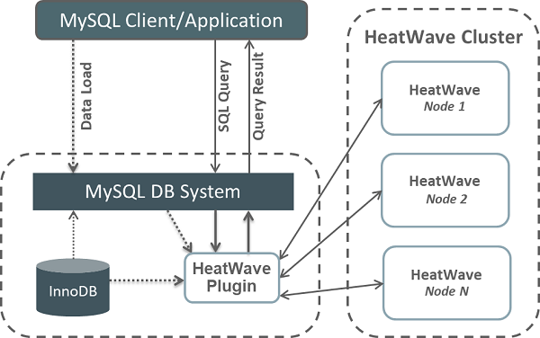
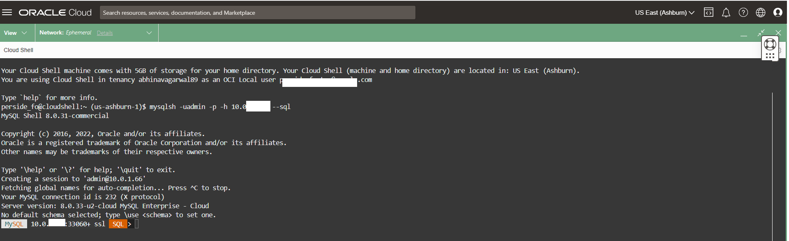
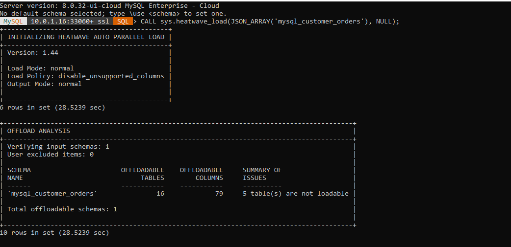
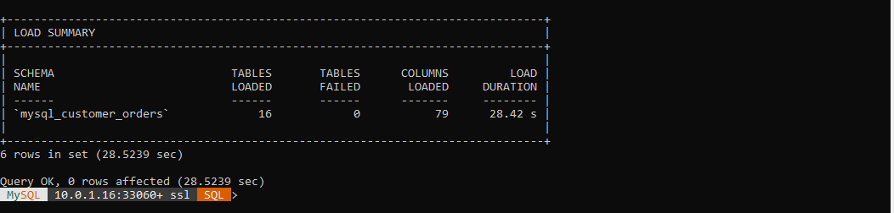
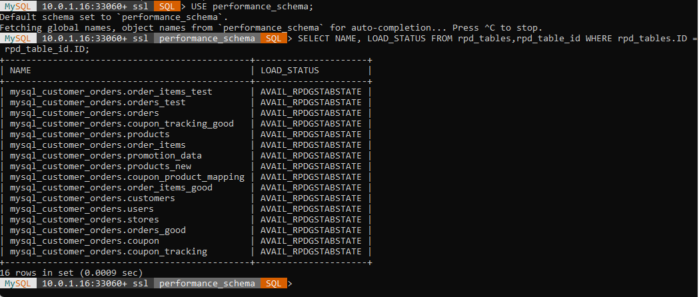
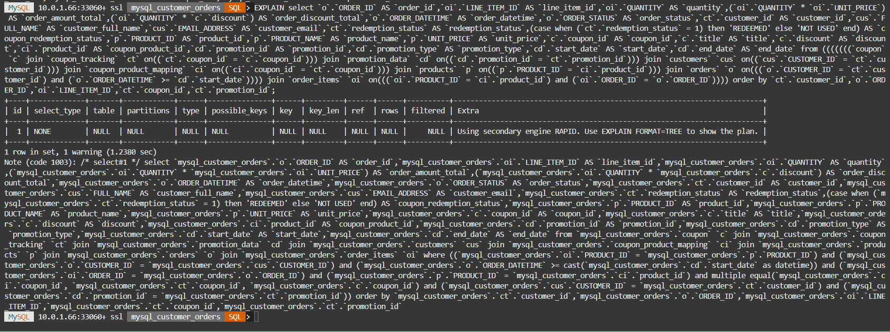
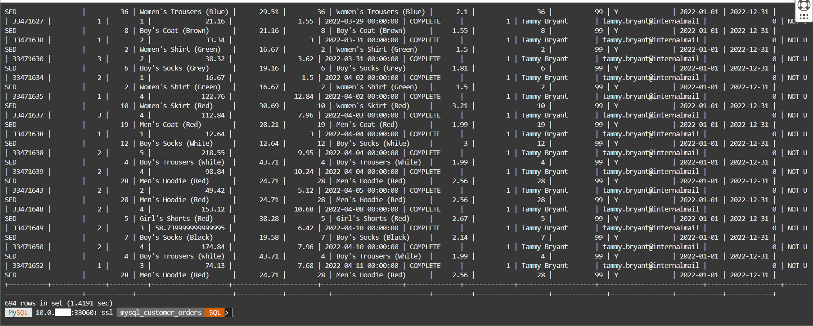
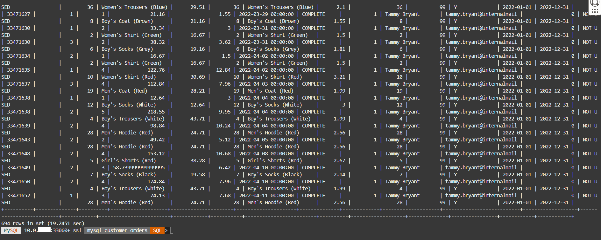

# Test Mysql HeatWave Cluster 

## Introduction

A HeatWave cluster comprise of a MySQL DB System node and two or more HeatWave nodes. The MySQL DB System node includes a plugin that is responsible for cluster management, loading data into the HeatWave cluster, query scheduling, and returning query result.

In this lab, you will load data and run queries in the HeatWave Cluster. You will see the query performance improvements on HeatWave compare to MySQL.



_Estimated Time:_ 15 minutes

### Objectives

In this lab, you will be guided through the following task:

- Load mysql\_customer\_orders Data into the HeatWave Cluster
- Run Comparison Queries  with the HeatWave Cluster loaded data

### Prerequisites

- An Oracle Trial or Paid Cloud Account
- Some Experience with MySQL Shell
- Completed Lab 2

## Task 1: Load Schema Data into HeatWave Cluster

1. Login to the OCI Console.
2. Click the Cloud Shell icon in the Console
3. Connect to MySQL using the MySQL Shell client tool with the following command:

    ```bash
    <copy>mysqlsh -uadmin -p -h 10.0.1... --sql </copy>
    ```

    

4. Run the following Auto Parallel Load command to load the  mysql\_customer\_orders tables data into the HeatWavecluster

    ```bash
    <copy>CALL sys.heatwave_load(JSON_ARRAY('mysql_customer_orders'), NULL);</copy>
    ```

5. The completed load cluster screen should look like this:

    

    

6. Verify that the tables are loaded in the HeatWave cluster. Loaded tables have an AVAIL_RPDGSTABSTATE load status.

    ```bash
    <copy>USE performance_schema;</copy>
    ```

    ```bash
    <copy>SELECT NAME, LOAD_STATUS FROM rpd_tables,rpd_table_id WHERE rpd_tables.ID = rpd_table_id.ID;</copy>
    ```

    

## Task 2: Run Queries in HeatWave

1. If not already connected then connect to MySQL using the MySQL Shell client tool with the following command:

    ```bash
    <copy>mysqlsh -uadmin -p -h 10.0.1... --sql </copy>
    ```

    

2. Change to the mysql\_customer\_orders database

    Enter the following command at the prompt

    ```bash
    <copy>USE mysql_customer_orders;</copy>
    ```

3. **Query 1** - List Customer total purchase for the year by month

4. Before running a query, use EXPLAIN to verify that the query can be offloaded to the HeatWave cluster. You should see "Use secondary engine RAPID" in the explain plan. For example:

    ```bash
    <copy>EXPLAIN select `o`.`ORDER_ID` AS `order_id`,`oi`.`LINE_ITEM_ID` AS `line_item_id`,`oi`.`QUANTITY` AS `quantity`,(`oi`.`QUANTITY` * `oi`.`UNIT_PRICE`) AS `order_amount_total`,(`oi`.`QUANTITY` * `c`.`discount`) AS `order_discount_total`,`o`.`ORDER_DATETIME` AS `order_datetime`,`o`.`ORDER_STATUS` AS `order_status`,`ct`.`customer_id` AS `customer_id`,`cus`.`FULL_NAME` AS `customer_full_name`,`cus`.`EMAIL_ADDRESS` AS `customer_email`,`ct`.`redemption_status` AS `redemption_status`,(case when (`ct`.`redemption_status` = 1) then 'REDEEMED' else 'NOT USED' end) AS `coupon_redemption_status`,`p`.`PRODUCT_ID` AS `product_id`,`p`.`PRODUCT_NAME` AS `product_name`,`p`.`UNIT_PRICE` AS `unit_price`,`c`.`coupon_id` AS `coupon_id`,`c`.`title` AS `title`,`c`.`discount` AS `discount`,`ci`.`product_id` AS `coupon_product_id`,`cd`.`promotion_id` AS `promotion_id`,`cd`.`promotion_type` AS `promotion_type`,`cd`.`start_date` AS `start_date`,`cd`.`end_date` AS `end_date` from (((((((`coupon` `c` join `coupon_tracking` `ct` on((`ct`.`coupon_id` = `c`.`coupon_id`))) join `promotion_data` `cd` on((`cd`.`promotion_id` = `ct`.`promotion_id`))) join `customers` `cus` on((`cus`.`CUSTOMER_ID` = `ct`.`customer_id`))) join `coupon_product_mapping` `ci` on((`ci`.`coupon_id` = `ct`.`coupon_id`))) join `products` `p` on((`p`.`PRODUCT_ID` = `ci`.`product_id`))) join `orders` `o` on(((`o`.`CUSTOMER_ID` = `ct`.`customer_id`) and (`o`.`ORDER_DATETIME` >= `cd`.`start_date`)))) join `order_items` `oi` on(((`oi`.`PRODUCT_ID` = `ci`.`product_id`) and (`oi`.`ORDER_ID` = `o`.`ORDER_ID`)))) order by `ct`.`customer_id`,`o`.`ORDER_ID`,`oi`.`LINE_ITEM_ID`,`ct`.`coupon_id`,`ct`.`promotion_id`;
 
    </copy>
    ```

    

5. After verifying that the query can be offloaded, run the query and note the execution time. Enter the following command at the prompt:

     ```bash
    <copy>select `o`.`ORDER_ID` AS `order_id`,`oi`.`LINE_ITEM_ID` AS `line_item_id`,`oi`.`QUANTITY` AS `quantity`,(`oi`.`QUANTITY` * `oi`.`UNIT_PRICE`) AS `order_amount_total`,(`oi`.`QUANTITY` * `c`.`discount`) AS `order_discount_total`,`o`.`ORDER_DATETIME` AS `order_datetime`,`o`.`ORDER_STATUS` AS `order_status`,`ct`.`customer_id` AS `customer_id`,`cus`.`FULL_NAME` AS `customer_full_name`,`cus`.`EMAIL_ADDRESS` AS `customer_email`,`ct`.`redemption_status` AS `redemption_status`,(case when (`ct`.`redemption_status` = 1) then 'REDEEMED' else 'NOT USED' end) AS `coupon_redemption_status`,`p`.`PRODUCT_ID` AS `product_id`,`p`.`PRODUCT_NAME` AS `product_name`,`p`.`UNIT_PRICE` AS `unit_price`,`c`.`coupon_id` AS `coupon_id`,`c`.`title` AS `title`,`c`.`discount` AS `discount`,`ci`.`product_id` AS `coupon_product_id`,`cd`.`promotion_id` AS `promotion_id`,`cd`.`promotion_type` AS `promotion_type`,`cd`.`start_date` AS `start_date`,`cd`.`end_date` AS `end_date` from (((((((`coupon` `c` join `coupon_tracking` `ct` on((`ct`.`coupon_id` = `c`.`coupon_id`))) join `promotion_data` `cd` on((`cd`.`promotion_id` = `ct`.`promotion_id`))) join `customers` `cus` on((`cus`.`CUSTOMER_ID` = `ct`.`customer_id`))) join `coupon_product_mapping` `ci` on((`ci`.`coupon_id` = `ct`.`coupon_id`))) join `products` `p` on((`p`.`PRODUCT_ID` = `ci`.`product_id`))) join `orders` `o` on(((`o`.`CUSTOMER_ID` = `ct`.`customer_id`) and (`o`.`ORDER_DATETIME` >= `cd`.`start_date`)))) join `order_items` `oi` on(((`oi`.`PRODUCT_ID` = `ci`.`product_id`) and (`oi`.`ORDER_ID` = `o`.`ORDER_ID`)))) order by `ct`.`customer_id`,`o`.`ORDER_ID`,`oi`.`LINE_ITEM_ID`,`ct`.`coupon_id`,`ct`.`promotion_id`;
    </copy>
    ```

    - With HeatWave Cluster **ON: 1.4191 seconds**

    

6. To compare the HeatWave execution time with MySQL DB System execution time, disable the `use_secondary_engine` variable to see how long it takes to run the same query on the MySQL DB System. For example:

    Enter the following command at the prompt:

     ```bash
    <copy>SET SESSION use_secondary_engine=OFF;</copy>
    ```

7. Enter the following command at the prompt:

     ```bash
    <copy>select `o`.`ORDER_ID` AS `order_id`,`oi`.`LINE_ITEM_ID` AS `line_item_id`,`oi`.`QUANTITY` AS `quantity`,(`oi`.`QUANTITY` * `oi`.`UNIT_PRICE`) AS `order_amount_total`,(`oi`.`QUANTITY` * `c`.`discount`) AS `order_discount_total`,`o`.`ORDER_DATETIME` AS `order_datetime`,`o`.`ORDER_STATUS` AS `order_status`,`ct`.`customer_id` AS `customer_id`,`cus`.`FULL_NAME` AS `customer_full_name`,`cus`.`EMAIL_ADDRESS` AS `customer_email`,`ct`.`redemption_status` AS `redemption_status`,(case when (`ct`.`redemption_status` = 1) then 'REDEEMED' else 'NOT USED' end) AS `coupon_redemption_status`,`p`.`PRODUCT_ID` AS `product_id`,`p`.`PRODUCT_NAME` AS `product_name`,`p`.`UNIT_PRICE` AS `unit_price`,`c`.`coupon_id` AS `coupon_id`,`c`.`title` AS `title`,`c`.`discount` AS `discount`,`ci`.`product_id` AS `coupon_product_id`,`cd`.`promotion_id` AS `promotion_id`,`cd`.`promotion_type` AS `promotion_type`,`cd`.`start_date` AS `start_date`,`cd`.`end_date` AS `end_date` from (((((((`coupon` `c` join `coupon_tracking` `ct` on((`ct`.`coupon_id` = `c`.`coupon_id`))) join `promotion_data` `cd` on((`cd`.`promotion_id` = `ct`.`promotion_id`))) join `customers` `cus` on((`cus`.`CUSTOMER_ID` = `ct`.`customer_id`))) join `coupon_product_mapping` `ci` on((`ci`.`coupon_id` = `ct`.`coupon_id`))) join `products` `p` on((`p`.`PRODUCT_ID` = `ci`.`product_id`))) join `orders` `o` on(((`o`.`CUSTOMER_ID` = `ct`.`customer_id`) and (`o`.`ORDER_DATETIME` >= `cd`.`start_date`)))) join `order_items` `oi` on(((`oi`.`PRODUCT_ID` = `ci`.`product_id`) and (`oi`.`ORDER_ID` = `o`.`ORDER_ID`)))) order by `ct`.`customer_id`,`o`.`ORDER_ID`,`oi`.`LINE_ITEM_ID`,`ct`.`coupon_id`,`ct`.`promotion_id`;
    </copy>
    ```

    - With HeatWave Cluster **OFF: 19.2451 seconds**

    

8. Keep HeatWave processing enabled

    ```bash
    <copy>SET SESSION use_secondary_engine=ON;</copy>
    ```

9. Exit MySQL Shell

      ```bash
      <copy>\q</copy>
      ```

You may now **proceed to the next lab**

## Acknowledgements

- **Author** - Perside Foster, MySQL Solution Engineering

- **Contributors** - Abhinav Agarwal, Senior Principal Product Manager, Nick Mader, MySQL Global Channel Enablement & Strategy Manager
- **Last Updated By/Date** - Perside Foster, MySQL Solution Engineering, May 2023
